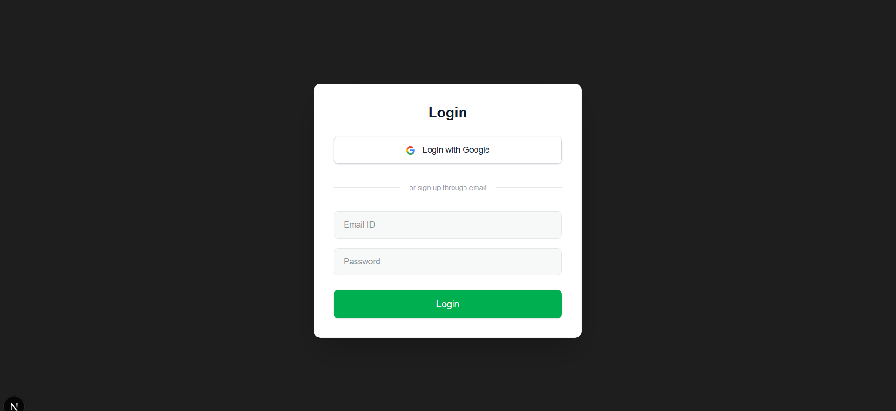
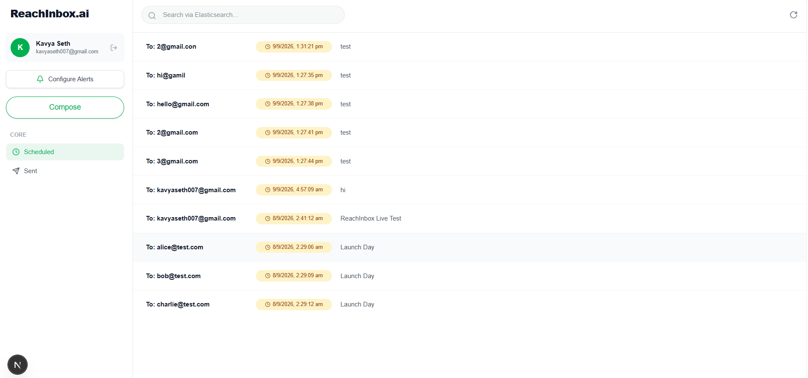
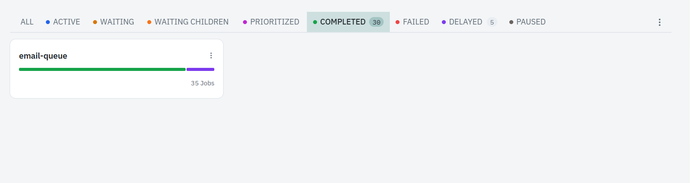
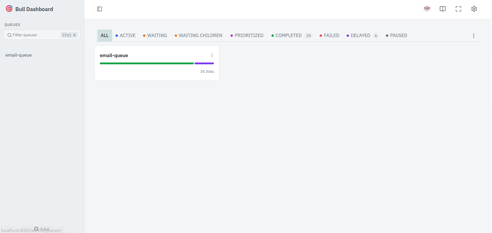
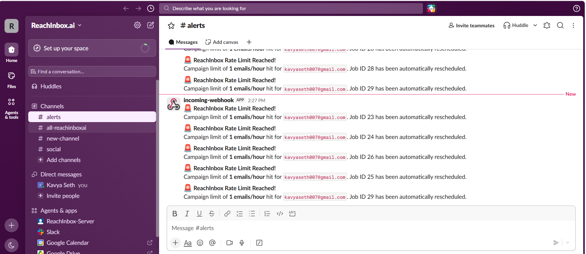
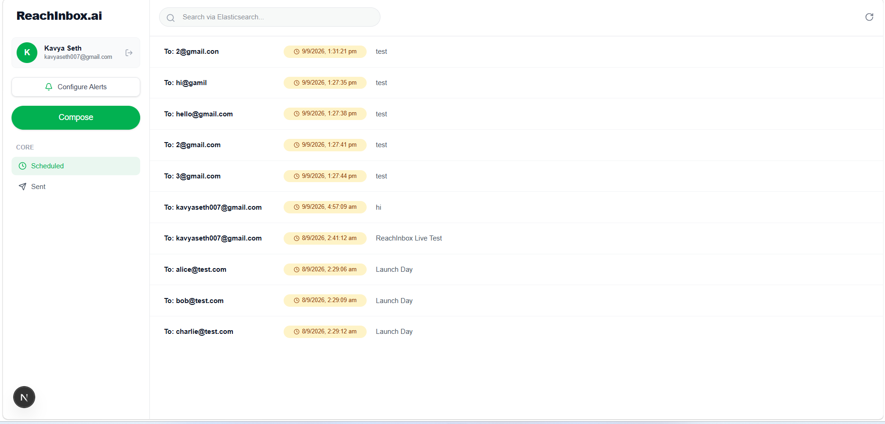

# ReachInbox.ai – Full-Stack Email Job Scheduler

A production-oriented full-stack email scheduling system built as part of the ReachInbox hiring assignment.

The application allows users to schedule emails, process them reliably using BullMQ and Redis, send emails through Ethereal SMTP, search emails using Elasticsearch, and monitor scheduled/sent emails through a React/Next.js dashboard.

---

## 🚀 Features

### Authentication
- Google OAuth login
- User session management using NextAuth
- User name, email and avatar/initial displayed in dashboard
- Logout functionality


### Email Scheduling
- Schedule emails for a specific time
- Upload CSV/TXT files containing email addresses
- Automatically detect email addresses from uploaded files
- Configure delay between emails
- Configure hourly email limit
- Support multiple recipients
- Persistent scheduled jobs using BullMQ and Redis


### Email Processing
- BullMQ delayed jobs
- Redis-backed persistent queue
- Configurable worker concurrency
- Minimum delay between email sends
- Hourly rate limiting
- Ethereal Email SMTP for testing
- Email status tracking:
  - `PENDING`
  - `SENT`
  - `FAILED`
  
  

### Elasticsearch
- Email indexing
- Search emails from the dashboard
- Search by recipient/subject/content
- Elasticsearch-backed search API

### Slack Alerts
- Slack OAuth integration
- Connect Slack workspace from dashboard
- Rate-limit notifications
- Notification is triggered when the configured hourly limit is reached
- Supports reconnect/disconnect without redeployment


### Dashboard
- Scheduled Emails view
- Sent Emails view
- Elasticsearch search
- Refresh functionality
- Background polling for updated email status
- Email details modal
- Loading states
- Empty states
- Error handling


### Queue Monitoring
- BullMQ dashboard
- Real-time queue/job visibility
- Monitor waiting, active, completed and failed jobs

---

# 🛠️ Tech Stack

## Frontend

- Next.js
- React.js
- TypeScript
- Tailwind CSS
- NextAuth
- Lucide React

## Backend

- Node.js
- Express.js
- TypeScript
- BullMQ
- Redis
- PostgreSQL / MySQL
- Elasticsearch
- Nodemailer
- Ethereal Email
- Slack OAuth

## Infrastructure

- Redis
- PostgreSQL / MySQL
- Elasticsearch
- Docker
- Git & GitHub

---

# 🏗️ Architecture

```text
                    ┌──────────────────────┐
                    │      Next.js UI      │
                    │      Dashboard       │
                    └──────────┬───────────┘
                               │
                               │ REST API
                               ▼
                    ┌──────────────────────┐
                    │    Express Backend   │
                    │      TypeScript      │
                    └───────┬───────┬──────┘
                            │       │
             ┌──────────────┘       └───────────────┐
             ▼                                      ▼
     ┌───────────────┐                      ┌──────────────┐
     │  PostgreSQL   │                      │ Elasticsearch│
     │  / MySQL      │                      │    Search    │
     └───────────────┘                      └──────────────┘
             │
             ▼
     ┌─────────────────┐
     │      Redis      │
     │                 │
     │     BullMQ      │
     └────────┬────────┘
              │
              ▼
     ┌─────────────────┐
     │   BullMQ Worker │
     │                 │
     │ Concurrency +   │
     │ Rate Limiting   │
     └────────┬────────┘
              │
              ▼
     ┌─────────────────┐
     │ Ethereal SMTP   │
     │ Email Sending   │
     └─────────────────┘

              │
              ▼

       ┌───────────────┐
       │   Slack OAuth │
       │ Rate Alerts   │
       └───────────────┘